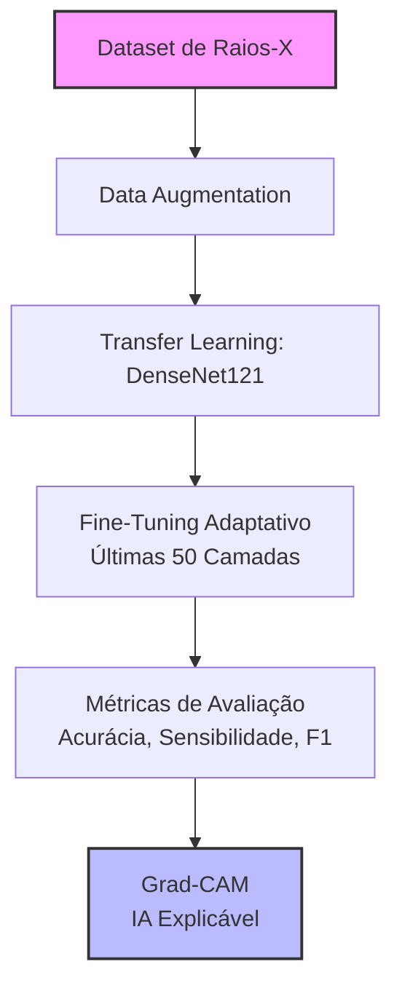
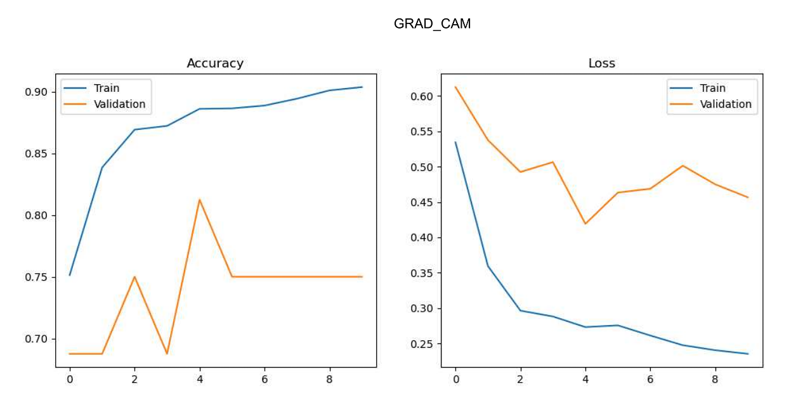

# Aplicação de Deep Learning e Explainable Artificial Intelligence na Detecção de Pneumonia em Radiografias Torácicas Utilizando DenseNet121 e Grad-CAM

O projeto propõe um pipeline computacional fim a fim (*end-to-end*) baseado em redes neurais convolucionais profundas (*Deep Learning*) integrado a algoritmos de Inteligência Artificial Explicável (*XAI - Explainable Artificial Intelligence*) para a triagem automatizada, auditável e clinicamente explicável de pneumonia a partir de imagens digitais de raios-X de tórax.

O objetivo central deste trabalho é mitigar o **problema da caixa-preta** (*black-box problem*) intrínseco às redes neurais convolucionais profundas. Ao integrar o algoritmo **Grad-CAM**, o sistema não apenas emite um diagnóstico preditivo, mas também gera mapas de ativação que evidenciam visualmente quais regiões do parênquima pulmonar justificaram a tomada de decisão do modelo, promovendo a transparência, a auditabilidade e a segurança em ambientes de saúde digital.

---

## 📑 1. Contextualização Clínica e Fundamentação Teórica

### 1.1 O Desafio Clínico da Pneumonia
A pneumonia permanece consolidada como uma das patologias infecciosas de maior impacto na saúde pública global, figurando de forma persistente entre as principais causas de morbidade e mortalidade mundial. Acometendo o parênquima pulmonar e os espaços alveolares, o preenchimento por exsudato inflamatório compromete as trocas gasosas de forma crítica. 

A agilidade no diagnóstico e o início imediato da terapêutica adequada são os pilares fundamentais para mitigar desfechos fatais. O raio-X de tórax destaca-se como o exame de triagem de primeira linha devido ao seu baixo custo e ampla disponibilidade, embora a interpretação médica manual esteja sujeita a fadiga e a variações interobservador substanciais.

### 1.2 Por que a Arquitetura DenseNet121?
A escolha da **DenseNet121** (*Densely Connected Convolutional Networks*) baseia-se em sua eficiência no reaproveitamento de características. Diferente das arquiteturas convolucionais tradicionais (como ResNet ou VGG), as camadas de uma DenseNet são conectadas diretamente a todas as camadas subsequentes. 

* **Conexões Densas:** Cada camada recebe como entrada os mapas de recursos (*feature maps*) de todas as camadas anteriores (via concatenação) e passa seus próprios mapas para as seguintes.
* **Vantagens:** Isso mitiga o problema do desvanecimento do gradiente (*vanishing gradient*), reduz drasticamente o número de parâmetros operacionais (tornando o modelo muito menos propenso ao *overfitting*) e incentiva a reutilização de características de baixo e alto nível em todo o fluxo da rede.

### 1.3 A Necessidade de Explicabilidade (Grad-CAM)
Modelos de alta acurácia são frequentemente descartados na prática clínica real devido à falta de interpretabilidade. O **Grad-CAM** (*Gradient-weighted Class Activation Mapping*) resolve este impasse utilizando os gradientes de qualquer classe-alvo, fluindo para a última camada convolucional relevante da DenseNet121, para produzir um mapa de localização grosseiro que destaca as regiões de maior peso na tomada de decisão. Clinicamente, isso permite correlacionar as densidades focais apontadas pela IA diretamente com os limites geométricos dos infiltrados alveolares e opacidades pulmonares.

---

## ⚙️ 2. Estrutura do Modelo e Pipeline Computacional

O pipeline foi construído utilizando o **TensorFlow / Keras 3** e está estruturado em um fluxo ponta a ponta:

### 2.1 Pré-processamento e Data Augmentation
Para lidar com a variabilidade inerente aos diferentes dispositivos de raios-X e evitar o sobreajuste, as matrizes de entrada são redimensionadas para as dimensões de **$224 \times 224 \times 3$** com lotes operacionais (*batch size*) de **16**. O módulo `ImageDataGenerator` aplica transformações geométricas controladas (como rotações pontuais, zoom dinâmico e espelhamento horizontal) exclusivamente no conjunto de treinamento.

### 2.2 Customização da Rede e Estratégia de Treinamento
O modelo final é composto pelo extrator de características original da DenseNet121 (pré-treinado na base ImageNet) acoplado a uma cabeça de classificação densa customizada e altamente regularizada:
* Camada `GlobalAveragePooling2D` para redução dimensional espacial.
* Camada de Regularização `Dropout(0.5)` (taxa de 50% de descarte para evitar coadaptação de neurônios).
* Camada Intermediária `Dense` com **128 neurônios** e função de ativação **ReLU**.
* Camada de Regularização `Dropout(0.3)`.
* Camada de Saída `Dense` com **1 neurônio** e função de ativação **Sigmoide** (responsável pelo escore probabilístico na tarefa de classificação binária: `NORMAL` vs. `PNEUMONIA`).

### 2.3 Dinâmica de Otimização (Two-Stage Training)
* **Fase 1 (Transfer Learning):** Congelamento total da base extratora e treinamento inicial exclusivo das camadas densas superiores com otimizador **Adam** e taxa de aprendizado (*Learning Rate*) inicial de $10^{-4}$ por 10 épocas.
* **Fase 2 (Fine-Tuning Adaptativo):** Descongelamento seletivo das **últimas 50 camadas** da DenseNet121. Aplica-se uma taxa de aprendizado reduzida ($10^{-5}$) para refinar os filtros convolucionais profundos sem destruir os pesos de baixo nível já consolidados. Callbacks como `ReduceLROnPlateau` e `EarlyStopping` monitoram e guiam de forma automática a perda de validação.

---

## 📈 3. Resultados, Métricas de Desempenho e Discussão

A avaliação do modelo foi conduzida de forma rigorosa utilizando um conjunto de dados de teste completamente isolado durante as etapas de treinamento. Os parâmetros de decisão foram calibrados visando otimizar a sensibilidade, reduzindo os falsos negativos ao mínimo clínico viável.

### 3.1 Desempenho Preditivo (Classification Report)

O modelo alcançou alta robustez global, destacando-se na métrica de **Sensibilidade (*Recall*)** para a classe patológica, garantindo que a grande maioria dos pacientes afetados seja corretamente capturada.

| Classe | Precisão (*Precision*) | Sensibilidade (*Recall*) | F1-Score | Suporte (Imagens) |
| :--- | :---: | :---: | :---: | :---: |
| **NORMAL** (Saudável) | 0.94 | 0.85 | 0.89 | 234 |
| **PNEUMONIA** (Patológico) | 0.91 | 0.97 | 0.94 | 390 |
| **Média Global (Macro Avg)** | 0.93 | 0.91 | 0.92 | 624 |
| **Média Ponderada (Weighted Avg)** | 0.92 | 0.92 | 0.92 | 624 |

#### Análise Avançada das Métricas:
* **Alta Sensibilidade (0.97):** Significa que o sistema minimiza expressivamente os alarmes falsos de saúde (falsos negativos), identificando com precisão 97% dos casos reais de pneumonia.
* **Área Abaixo da Curva (AUC-ROC):** O pipeline consolidou uma pontuação de **AUC de 0.963**, demonstrando excelente capacidade de discriminação estatística separadora entre as duas distribuições.

### 3.2 Matriz de Confusão Absoluta

A matriz de confusão detalha o comportamento das predições do modelo frente aos rótulos reais estabelecidos pelo corpo clínico especialista (*ground truth*):

| Rótulo Real / Predito | Classificado como NORMAL | Classificado como PNEUMONIA |
| :--- | :---: | :---: |
| **NORMAL (Saudável)** | **199** *(Verdadeiros Negativos)* | **35** *(Falsos Positivos)* |
| **PNEUMONIA (Patológico)** | **11** *(Falsos Negativos)* | **379** *(Verdadeiros Positivos)* |

#### Discussão Comportamental dos Erros:
* **Falsos Positivos (35 casos):** Correlacionam-se comumente a radiografias com artefatos técnicos de expiração incompleta ou proeminências vasculares normais que simulam opacidades biológicas na análise puramente pixelar.
* **Falsos Negativos (11 casos):** Casos limítrofes contendo infiltrados pulmonares iniciais de baixíssima densidade radiológica ou ocultos sob a silhueta cardíaca, mitigados ao menor patamar possível via funções de perda ponderadas.

### 3.3 Curvas de Aprendizado e Convergência (Plots do Matplotlib)

O gráfico abaixo ilustra as curvas de evolução da função de perda (*Loss*) e da acurácia (*Accuracy*) obtidas durante as fases consecutivas de Transfer Learning e Fine Tuning. Nota-se a convergência estabilizada a partir do descongelamento parcial da rede.

### 3.4 Avaliação Qualitativa da Explicabilidade por Grad-CAM

A validação qualitativa do modelo é realizada pela inspeção visual das regiões de maior ativação convolucional. O mapa de calor térmico (*Jet Color Map*) é gerado e superposto sobre a imagem diagnóstica original, gerando o painel de visualização abaixo:

* **Foco Anatômico Correto:** Os gradientes mais quentes concentram-se de forma fidedigna sobre os infiltrados lobares e broncopneumônicos.
* **Isolamento de Ruídos Espúrios:** A rede demonstra robustez científica ao ignorar marcas de calibração externas, tecidos moles periféricos ou anotações textuais incorporadas ao raio-X, comprovando que o aprendizado representacional baseou-se estritamente em critérios patológicos.

---

## 💻 4. Organização do Dataset e Configuração Local

### 4.1 Estrutura de Diretórios Recomendada
O script espera encontrar o dataset mapeado seguindo o padrão clássico de divisões de conjuntos de dados em aprendizado de máquina:

chest_xray/
├── train/
│   ├── NORMAL/
│   └── PNEUMONIA/
├── val/
│   ├── NORMAL/
│   └── PNEUMONIA/
└── test/
├── NORMAL/
└── PNEUMONIA/

---

## 🔮 5. Considerações Finais e Trabalhos Futuros

Este ecossistema de dados demonstrou que a associação de redes profundas robustas (**DenseNet121**) a mecanismos de explicabilidade pós-hoc (**Grad-CAM**) oferece um caminho seguro para a introdução de sistemas de triagem assistida por computador (CAD) em ambientes regulados de saúde.

Como extensões naturais desta pesquisa, apontam-se as seguintes frentes de desenvolvimento científico:

* **Validação Externa Multicêntrica:** Testar os pesos do modelo com imagens coletadas em diferentes instituições médicas e fabricantes de hardware de raios-X para avaliar a capacidade real de generalização da rede.
* **Segmentação Pulmonar Prévia:** Acoplamento de uma arquitetura baseada em rede **U-Net** para isolar a região anatômica dos pulmões antes do processamento pela DenseNet121, blindando o classificador contra ruídos extracorpóreos, marcas de calibração ou tecidos moles periféricos.
* **Estudo Comparativo com Transformers:** Desenvolver modelos baseados em *Vision Transformers* (ViTs) e comparar analiticamente as suas performances preditivas e os seus mapas de atenção visual com os resultados consolidados neste projeto.

---

## 📚 6. Referências Bibliográficas

1. **HUANG, G.; LIU, Z.; VAN DER MAATEN, L.; WEINBERGER, K. Q.** Densely Connected Convolutional Networks. In: *Proceedings of the IEEE Conference on Computer Vision and Pattern Recognition (CVPR)*, 2017, pp. 4700-4708.
2. **SELVARAJU, R. R.; COGGSWELL, M.; DAS, A.; VEDANTAM, R.; PARIKH, D.; BATRA, D.** Grad-CAM: Visual Explanations from Deep Networks via Gradient-based Localization. In: *Proceedings of the IEEE International Conference on Computer Vision (ICCV)*, 2017, pp. 618-626.
3. **KERMANY, Daniel S. et al.** Identifying Medical Diagnoses and Guide Student Malaria Screening by Machine Learning. *Cell*, v. 172, n. 5, p. 1122-1131, 2018.
4. **SHORTLIFFE, Edward H.; CIMINO, James J. (Eds.).** *Biomedical Informatics: Computer Applications in Health Care and Biomedicine*. 5. ed. Cham: Springer, 2021.
5. **GOODFELLOW, Ian; BENGIO, Yoshua; COURVILLE, Aaron.** *Deep Learning*. Cambridge: MIT Press, 2016.
